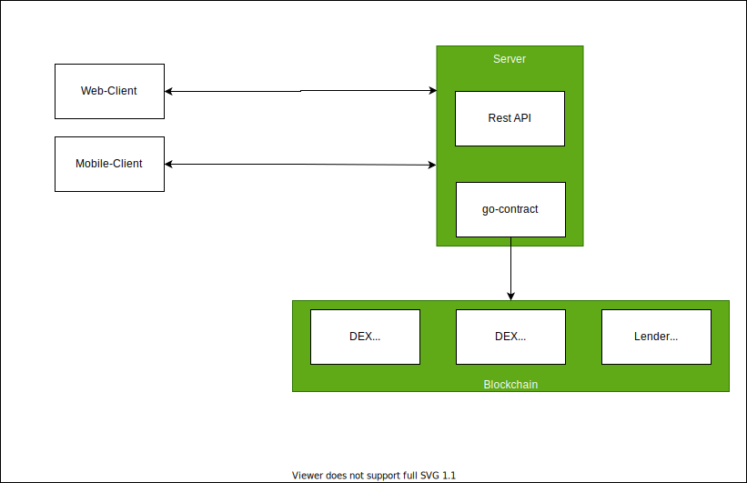

# dex-go-server
Server to expose DEXes smart contract api

## Organizatoin of the repo
### contract-abi: 
DEX and Lender Smart Contract ABIs. Currently contains Aave, Curve-Fi and UniswapV2. Dex and Lender may contain more than one ABI corresponding to core and management contracts 
### go-contracts
Go bindings of the contract API. The contract bindings for Lender or DEX is organized in to separate packages.


## Code generation
Server and Clinet codes are generated using swagger  
https://editor.swagger.io/


## Architecture



## Development

### Generate go resp api server from the openapi specification
```
docker run --rm -v "${PWD}:/local" openapitools/openapi-generator-cli generate -i /local/api/openapi.yaml  -g go-server -o /local/go-server --package-name=restapi
```

### Running
```
export DEX_INFURAID="xxxxxxxxxxxxxxxxxxxxx"
go run main.go
```
